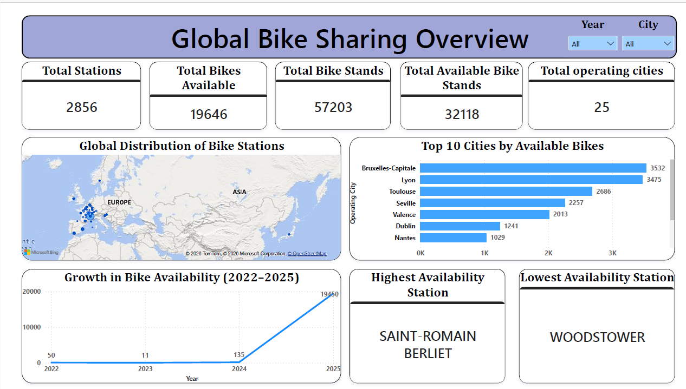
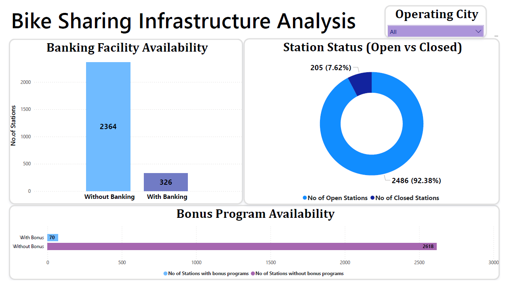

# 🚴 Global Bike Sharing System Analysis

## 📌 Project Overview
This project focuses on analyzing global bike-sharing systems to understand bike availability, station distribution, and operational efficiency across multiple cities. Using Power BI, the data was transformed into meaningful insights to support better decision-making and system optimization.

---

## 🎯 Objectives
- Analyze bike availability across cities and stations  
- Identify high-demand and low-availability stations  
- Study infrastructure availability (banking, bonus programs, station status)  
- Understand geographic distribution of bike stations  
- Analyze growth trends over time  
- Provide data-driven recommendations  

---
## 📁 Project Structure
```
bike-sharing-analysis/
│
├── Data/
│   ├── Raw Data/
│   │   └── bike-stations-sharing-data.xlsx
│   │
│   └── Cleaned Data/
│       └── Bike Sharing Data_Cleaned.xlsx
│
├── PowerBI/
│   ├── Bike_sharing_Data_Cleaning.pbix
│   └── Bike_Sharing_Data_Model_Data_model_and_visualizations.pbix
│
├── Documentation/
│   └── Bike Sharing System Analysis and Visualization Document.pdf
│
├── Screenshots/
│   ├── Global_Bike_Sharing_Overview.png
│   └── Bike_Sharing_Infrastructure_Analysis.png
│
└── README.md
```
## 📊 Dataset Information
The dataset contains station-level operational and geographic data across multiple cities.

### Key Features:
- City Name  
- Station Name & ID  
- Latitude & Longitude  
- Available Bikes  
- Bike Stands  
- Banking Facility  
- Bonus Program  
- Station Status (Open/Closed)  
- Timestamp  

---

## 🛠 Tools & Technologies
- **Power BI** – Dashboard & visualization  
- **Power Query** – Data cleaning & transformation  
- **DAX** – Measures and calculations  
- **Excel** – Data modeling & preprocessing  

---

## 🧱 Data Modeling
- Implemented **Star Schema**
- Created:
  - Fact Table: `Fact_BikeStatus`
  - Dimension Tables: `Dim_Station`, `Dim_City`, `Dim_Date`
- Built relationships for efficient filtering and analysis  

---

## 📈 Dashboards

### 🔹 Global Bike Sharing Overview


Provides a high-level view of the system:
- Total stations, bikes, and cities  
- Geographic distribution of stations  
- Top 10 cities by bike availability  
- Growth trends (2022–2025)  
- Highest & lowest availability stations  

---

### 🔹 Bike Sharing Infrastructure Analysis



Focuses on operational insights:
- Banking facility availability  
- Bonus program availability  
- Station status (Open vs Closed)  
- Identifies infrastructure gaps  

---

## 🔍 Key Insights

- Bike-sharing stations are highly concentrated in Western Europe, indicating regional dominance in adoption.

- Major cities have higher bike availability, but they also experience significantly higher demand, leading to supply imbalance.

- Several stations show surplus bikes, while others face shortages, highlighting inefficient distribution.

- Only a small proportion of stations provide banking and bonus facilities, indicating limited adoption of advanced infrastructure.

- A number of stations are inactive or closed, affecting overall system efficiency.

- Bike availability has shown strong growth over time, reflecting increasing adoption and system expansion. 

---

## 💡 Business Recommendations

- **Optimize bike distribution**  
  Use real-time data to redistribute bikes from surplus stations to high-demand locations.

- **Demand-driven expansion**  
  Increase bike stations and capacity in cities with consistently high demand.

- **Digital payment integration**  
  Enable seamless payments through platforms like Google Pay, PhonePe, and Paytm, along with QR-based bike unlocking.

- **Strategic bonus programs**  
  Encourage users to return bikes to low-availability stations using incentive-based rewards.

- **Introduce bike pooling**  
  Implement shared ride options during peak hours to handle shortages efficiently.

- **Smart system enhancements**  
  - Predict demand using historical data  
  - Provide real-time availability alerts  
  - Influence user behavior through dynamic incentives

---

## 📚 Key Learnings
- Built a **Star Schema data model**  
- Worked with **time-dependent attributes in fact tables**  
- Improved **data visualization & storytelling skills**  
- Gained hands-on experience in **Power BI & DAX**  

---

## 🚀 Conclusion
This project demonstrates how data analytics can be used to optimize bike-sharing systems through data-driven insights. It highlights operational inefficiencies and provides actionable recommendations to improve system performance and user experience.

---

## 👤 Author

**Divya Thatha**  
📊 Data Analyst | Power BI Enthusiast  

- 📧 Email: thathadivya@example.com  
- 🔗 LinkedIn: [(https://www.linkedin.com/in/divya-thatha/) ] 
 

---
